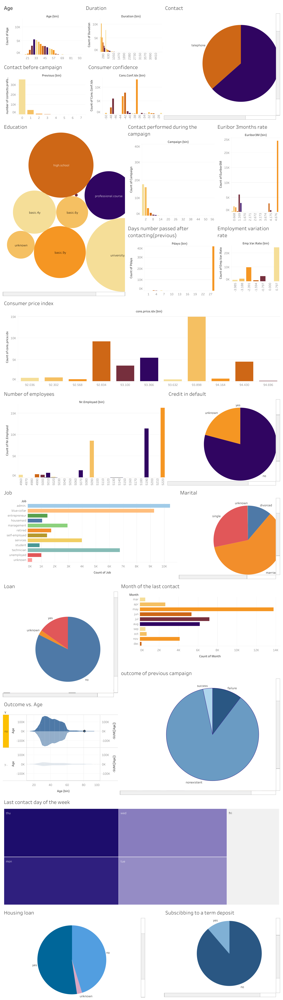

# 📊 Bank Marketing Campaign Analysis

This project analyzes the effectiveness of a Portuguese bank's telemarketing campaign using **Linear and Logistic Regression**. The analysis aims to uncover the factors influencing the success of marketing calls and provide data-driven recommendations to improve future campaigns.

---

## 📌 Project Overview

The dataset consists of marketing call records collected between **May 2008 and November 2010**. The key goals of this project:

- Explore client and campaign-related features.
- Identify patterns in successful vs. unsuccessful campaigns.
- Apply regression techniques to model the outcomes.
- Generate actionable marketing insights.

---

## 🧠 Techniques Used

### 📈 Linear Regression

- Predicts continuous outcomes like Consumer Confidence Index.
- Used to explore relationships between economic variables and campaign performance.
- Metrics like **R-squared** and **Adjusted R-squared** were used for evaluation.

### 📉 Logistic Regression

- Used to predict binary outcomes (success/failure of a campaign).
- Employed the **sigmoid function** to estimate probabilities.
- A leaner logistic model was developed by selecting the most relevant features.

---

## 🔍 Key Findings

- **Shorter call durations** and **fewer contacts** lead to better success rates.
- Campaign success correlated with **lower euribor3m interest rates**.
- **Economic indicators** (like `emp.var.rate`, `cons.price.idx`) significantly influence campaign results.
- Simplifying the logistic model improved predictive performance.

---

## 📊 Tools and Libraries

- **Python**: `pandas`, `numpy`, `matplotlib`, `seaborn`, `scikit-learn`
- **Tableau**: For interactive visual analytics
- **Jupyter Notebook**
- **PowerPoint**: Final presentation slides

---

